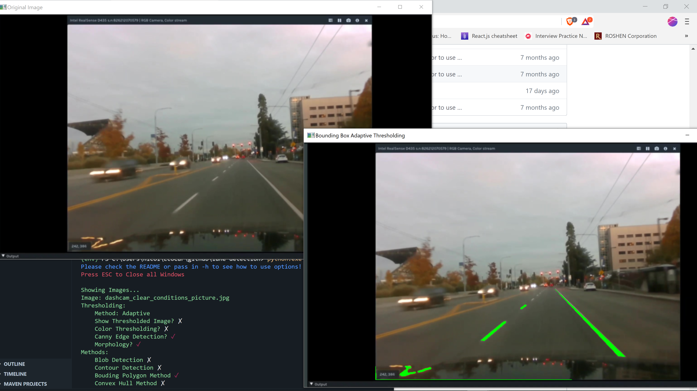

# A program to detect lanes

## How to use image_detector.py:

### Required Packages (or use requirements.txt):
* argparse (Default)
* cv2 (Install Required)
* numpy (Install Required)
* colorama (Might Require Install)

### Example Output
Running just `python image_detector.py` outputs:

You can see it outputs the original and the lanes detected using the Convex Hull method.
In the console on the bottom left every method used is checked and everything not used is x'ed out (Pretty!).
To exit press `Esc`. More info below!

### Command Line Options
Running the script with no command line options will run all options that say 'Default True'. Outputs contour detection on the   
default image (lane-test.jpg) with canny edge detection and Otsu's Tresholding.

Usage:   
`python image_detector.py [-h] [-image IMAGE PATH] [-blob] [-adaptive] 
                        [--show-thresh] [-contour] [--bounding-polygon]
                        [--convex-hull] [-color] [-canny] [-all]`

Options: 
* -h, --help
  * shows help message and exits
* -image IMAGE
  * Putting the name of an image directly after -image will change the image to run detection on
* -color
  * Runs the Detection With Color Thresholding for White and Yellow
* -canny
  * Runs the Detection With Canny Edge Detection for White and Yellow (Default True)
* -otsu
  * Changes thresholding method to Otsu (default is adaptive)
* --show-thresh
  * Outputs the thresholded image using cv2.imshow
* -blob
  * Output the result of blob detection
* -contour
  * Output the result of contour detection (Default True)
* --bounding-polygon
  * Outputs the reuslt of the boulding polygon method
* --convex-hull
  * Output the result of the Convex Hull Method
* -all
  * Run Contour, Blob, Convex Hull, and Bounding Polygon Detection. Does not change any Thresholding Values.

Note:   
* Order of options does not matter.  
* Only one thresholding method can be used at a time (Adaptive or Otsu).  
* No duplicate images will be shown.

Examples:
* `python ./image_detector.py` will output the default image (lane-test.jpg) using the default  
method (Adaptive thresholding) and the default method (Contour Detection)
* `python ./image_detector.py -image lane-test.jpg` will output Contour Detection with Adaptive Thresholding  
from the image lane-test.jpg
* `python ./image_detector.py -blob --bouding-polygon --show-thresh` will output Blob Detection, Bouding Polygon  
method, and show all thresholding images using Adaptive Thresholding
* `python ./image_detector.py -blob --bouding-polygon --show-thresh -otsu` will output Blob Detection,   
Bouding Polygon method, and show all thresholding images using Otsu Tresholding

## How to use video_detector.py:

### Required Packages:
* cv2 (Install Required)
* numpy (Install Required)

### Command Line Options

Usage:   
`python video_detector.py` Outputs video with bouding polygons (More to Come)

Enjoy!